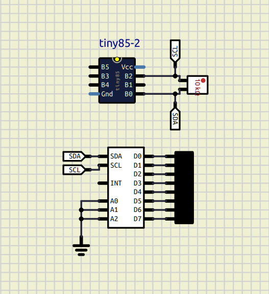
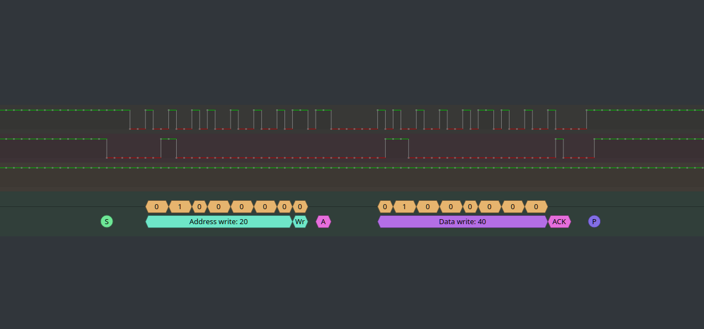

# AVR I2C on Assembly

This is an example implementation for a basic I2C master node on AVR assembly
using attiny's USI module, with a manually advancing clock.

Here we send a byte to a PCF8574 to turn on a LED connected to its PIN 6.

# Status

Should be working:

    - Line clear detection
    - Setting start condition
    - Sending a byte with write operation
    - Node SCL release wait
    - Node ACK check

What I could probably add:

    - Sending a byte with read operation
    - Reading data from a node
    - Repeated start condition
    - Bigger than 7bits addresses?
